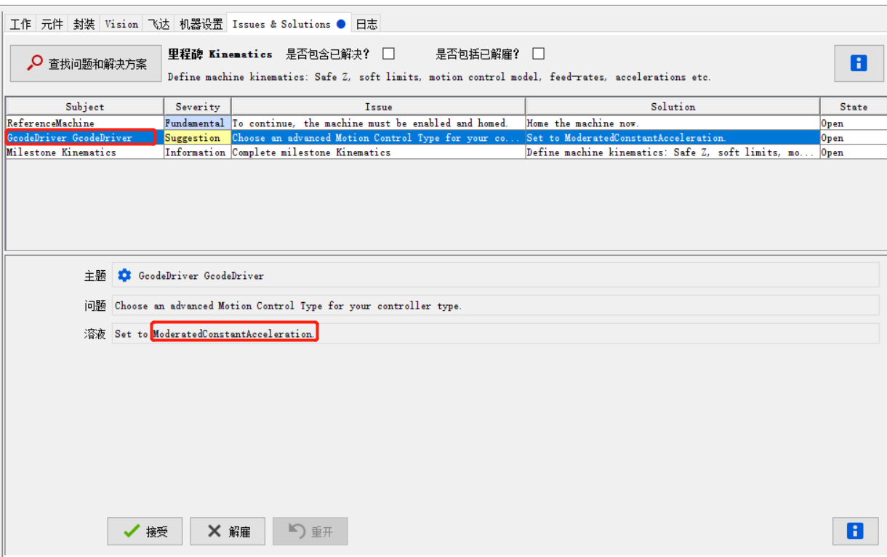

# OpenPNP配置

## 1 开始清空配置

删除如下目录里的所有 xml文件

```
C:\Users\Administrator\.openpnp2\
```

删除后，所有配置清空，下次打开OpenPNP时，会重新创建新的xml配置文件

## 2 创建一个驱动器

1 删除旧的驱动器


2 新建一个新的驱动器（对应smothieBoard控制板）


## 3 配置驱动

3.1 配置驱动器的Name及通信方式


3.2 配置命令等待时间

配置开始阶段，适当延长等待时间，连接时间等参数


## 4 设置轴信息

### 4.1 删除旧的轴信息

依次删除如下轴配置


### 4.2 新建X轴


按照推荐值配置X轴信息


### 4.3 新建Y轴

方法同X轴

### 4.4 新建Z轴

方法同X轴。

注意Z轴的设置其中Home Coordinate根据自己的机器，设置为一个合理的值，他的目的是为了保证在移动时保证吸嘴的安全，防止出现吸嘴一上一下，移动过程中，可能会碰到吸嘴，最好的方式是保证两吸嘴齐平的状下，记录Z的位置，此处根据自己的机器，设置Home Coordinate为30。


### 4.5 旋转轴1设置

新建旋转轴1，配置如下：


### 4.6 旋转轴2设置

新建旋转轴2，配置如下：


## 5 顶部灯执行器设置

### 5.1 删除旧的执行器

如图，删除旧的执行器。


### 5.2 设置新的顶部LED执行器

新建顶部LED执行器，并按下图进行设置。


### 5.3 顶部LED执行器Gcode代码设置

选择驱动->Top Light->ACTUATE_BOOLEAN_COMMAND,输入如下的Gcode代码

```
{True:M106}
{False:M107}
```

## 6 底部灯执行器设置

### 6.1 删除旧的执行器

如图，删除旧的执行器。


### 6.2 设置新的顶部LED执行器

新建顶部LED执行器，并按下图进行设置。


### 6.3 底部LED执行器Gcode代码设置

选择驱动->Bottom Light->ACTUATE_BOOLEAN_COMMAND,输入如下的Gcode代码

```
{True:M42}
{False:M43}
```

## 7 顶部相机配置

### 7.1 删除并重新建立新的顶部相机

删除并重新建立新的顶部相机，其配置如下：


### 7.2 选择相机

选择顶部相机，点击Test确认选择正确的相机


### 7.3 旋转相机

按照机器的具体情况，设置相机旋转角度


### 7.4 相机校准

将下图放在顶部相机下，进行相关校准（相机鱼眼图校准）。


### 7.5 顶部相机尺寸设置

底部相机尺寸设置如下图，使用带尺寸的PCB板或使用其它标记尺寸的设备，标定每个像素的长度。


## 8 底部相机配置

### 8.1 删除并重新建立新的底部相机

删除并重新建立新的底部相机，其配置如下：


### 8.2 选择相机

选择底部相机，点击Test确认选择正确的相机


### 8.3 旋转相机

按照机器的具体情况，设置相机旋转角度


### 8.4 相机校准

将下图放在顶部相机下，进行相关校准（相机鱼眼图校准）。


### 8.5 顶部相机尺寸设置

顶部相机尺寸设置如下图，使用带尺寸的PCB板或使用其它标记尺寸的设备，标定每个像素的长度。


## 9 创建电磁阀控制器

### 9.1 删除旧执行器并新建电磁阀执行器

删除旧执行器并新建电磁阀执行器，执行器1执行器2配置方法一致。


### 9.2 配置电磁阀Gcode

选择驱动->H1 AVAC1->ACTUATE_BOOLEAN_COMMAND,输入如下的Gcode代码

```
{True:M280}
{False:M281}
```

选择驱动->H1 AVAC1->ACTUATE_BOOLEAN_COMMAND,输入如下的Gcode代码

```
{True:M282}
{False:M283}
```

需要注意的是此处的Gcode代码和驱动板相关，例如，对于Smothieboard或skr1.4来讲可以通过config文件来配置

```makefile
switch.bltouch.enable                    true         #
switch.bltouch.output_pin                1.22         # sw pwm can use any digital pin
switch.bltouch.input_on_command          M280         #
switch.bltouch.input_off_command         M281         #
switch.bltouch.output_type               swpwm        # sw pwm must be low frequency
switch.bltouch.pwm_period_ms             20           # 50Hz
switch.bltouch.startup_state             false        # start up in the stow state
switch.bltouch.startup_value             7.43         # On boot it will go into stow mode, also set with the M281
switch.bltouch.default_on_value          3.3          # if M280 is issued without S this is the value it will set it to


switch.VAC.enable                           true             # Enable this module
switch.VAC.input_on_command                 M282             # Command that will turn this switch on
switch.VAC.input_off_command                M283             # Command that will turn this switch off
switch.VAC.output_pin                       1.23             # Pin this module controls
switch.VAC.output_type                      digital          # Digital means this is just an on or off pin
```


## 10 喷嘴设置

### 10.1 根据向导创建喷嘴

如图，根据向导创建双喷嘴。


根据向导创建喷嘴后，会自动生成几个轴信息，删除自动创建的轴信息，使用我们之前创建的轴信息。


### 10.2 设置喷嘴信息


## 11 Issues & Solutions

### 11.1 串口配置


根据自己情况，这里我没有使用流控，选择Dismiss.

### 11.2 完成里程碑1


保证完成之前的问题后，选择Proceed to Basics. Accept.

### 11.3 顶部相机Issues

完成上述里程碑后，会检测出之前设置的新的问题，问题1：顶部相机轴信息未配置。


顶部相机关联的轴信息包括X Y Z Rotation.这里顶部相机和Z轴、旋转轴无位置关系，我们为其新建两个虚拟轴。


之后为顶部相机配置关联轴信息。


### 11.4 旋转轴Issues


用字母A B代替E F.

### 11.5 创建Z_Map

由于我们使用的是皮带轮的结构，两个喷嘴一上一下，所以创建一个Z_Map轴，映射到Z轴，如下图。


### 11.6 喷嘴配置轴信息


为喷嘴配置轴信息，如下图：


偏移的配置按照如下向导进行配置。


### 11.7  设置头部泵执行器


头部缺少泵控制器，由于硬件上没有多于的IO口驱动，暂时使用手动的方式进行控制，为了方便后续加入，我们创建一个泵控制器，执行空的指令，待控制板更新后，加入新的指令。


### 11.8 Gcode命令确认


Gcode命令确认正则表达式未配置，可以到驱动-GcodeDriver里进行配置，也可以直接接受修改，此处直接Accept进行配置。

### 11.9 运动Gcode


提示POSITION_REPORT_REGEX指令未配置，直接Accept,配置后加入了运动指令。

### 11.10 配置其它Gcode


其它Gcode接受默认。

### 11.11 完成里程碑2


确认完成后，完成里程碑。

### 11.12 鼠标拖动

以上设置后，可以正常X Y轴运动，但不能拖动，提示如下：


使用Z轴的安全区域。


### 11.13 更换喷嘴位置


移动到一个可以手动更换N1喷嘴的位置，点击接受，之后要更换喷嘴，会移动到此位置，同样的方法设置喷嘴N2。

或者也可以在喷嘴页面设置：


### 11.14 设置轴的速度-加速度-加加速度


按照提示，需要设置合适的速度-加速度-加加速度，如下图：


同样的方法设置C2。

### 11.15 喷嘴对齐元件


Accept，会旋转喷嘴以对齐元器件，或者可以在Mechine Setup中进行设置。喷嘴N2同理设置。


### 11.16 喷嘴旋转优化


提示建议限制旋转角度至-180~180，并且优化旋转路径，选择Accept，或在Mechine Setup中进行设置。

### 11.17 COMMAND-dismiss


以上两个代码Dismiss，按之前的配置。

### 11.18 Motion Control Type



修改为缓慢匀加速运动，此外我们选择Dismiss。

### 11.19 动态安全Z


根据推荐选择动态安全Z，此方式考虑喷嘴和吸附上面元件的高度。或者通过以下方式设置。


### 11.20 安全Z高度


移动N1到最高的物体上方，调整Z的高度，之后点击Accept,同样方式设置N2.

### 11.21 Top Light安全高度


TopLight,电磁阀控制器，安全高度不设置，Dismiss.

### 11.22 设置XYZ的软极限位置


 把X轴移动到可以达到的最小值点，Accecpt low side soft linit of X.其它设置方法相同。

修改后在相应轴设置里可以看到同时进行了修改。


### 11.23 设置视觉基准

把顶部相机移动至主基准点（mark点），按Auto-Adjust,自动匹配Mark点大小，为了后面准确识别，在自动Mark点大小识别后，一般再加一点点（2-3左右），之后点击Accept，头部会从各个方位运动到Mark点进行校准，校准成功后会State会变绿，表明已解决这一问题。相同方法设置第二基准点，第二基准点Mark点的高度(Z轴)不同，方便进行3D校准。


### 11.24 喷嘴基准校准


按向导提示，将N1喷嘴调整到主基准点（PCB上的Mark点），使喷嘴刚好接触到PCB上的主基准点，点击Accept，同样的方法设置第二基准点。

N2喷嘴设置方法同N1.

### 11.25 底部相机位置和校准


将喷嘴移动到底部相机中心位置，使用Auto-Adjust自动检测出基准圆直径，点击Accept，之后机器会自动进行校准，喷嘴会移动到不相机中心周围点进行校准，同时还会转动喷嘴以校准旋转轴的同心度等问题。

### 11.26 相机稳定时间


由于相机存在一定的延时，为了能够获取稳定的相机图片，图像的捕获需要一定的延时，此处是为了测试出顶部相机的稳定时间，点击Accept，相机会运动到基准点位置，用于检测稳定时间，如下图为检测的移动时间。如需提高速度，减少稳定时间，需要从相机延时、机械震动等多方面优化，本次先不作优化。


底部相机设置方法类似。


### 11.27 视觉Home点设置


相机移动到Home基准点(固定不动的Mark点)，点击Auto-Adjust自动识别基准点直径，识别到后会用绿圈标注，点击Accept，相机运动到Home点中心，并将此点作为视觉Home基准点。

如果需要启动后执行Home指令，按下图进行设置：


### 11.28 顶部相机FPS-及渲染质量

按照推荐，设置顶部相机FPS为5，相机渲染质量为高（之前修改相机为72度后，未选择渲染质量高）。


注意：修改渲染质量后，需要重新对相机进行鱼眼校准，相机3S校准等操作，在machine.xml中删除以后字段，可以在Issues&Solutions中重新按向导进行3D校准。


### 11.29 相机属性-白平衡设置

按照向导推荐，设置相机相关属性。


白平衡修改前后对比：


底部相机相关配置方法同顶部相机。

### 11.30 标定XY轴回程补偿

设置好X轴的软件限位后，Accept开始进行回程补偿标定，Accept后，机器会从不同方向，不同速度运动到基准点，计算机器的误差进行补偿。


如下图，补偿后，在X轴信息中可以看到其回程补偿具体信息。


Y轴回程补偿校准方法同X轴。

### 11.31 喷嘴偏差校准

按照向导要求，在主基准点上放一个圆形纸片，让喷嘴反复以不同角度去拾取放置纸片，用以校准喷嘴同轴度等问题。喷嘴1 2 校准方法相同。


### 11.32 NT1 NT2喷嘴校准

之前配置N1 N2为贴片机头上的喷嘴信息，此处为喷嘴本身的信息，例如，贴片机头上一个的N1，可以装载NT1，或NT2,如果有更多的喷嘴，只要兼容，贴装头上N1可以到达此喷嘴位置，也可以进行装载。本机器只有两个喷嘴，暂不设置(Dismiss)，待做自动换吸嘴功能时再进行设置。


若之后需要进行设置，只需要将Machine.xml中如下两行删除，再根据向导进行配置。

```
         <dismissed-solutions class="java.util.HashSet">
         	...
            <string>a41e7d45fb2a5840bae63668d5c4dd9b9c956bf8</string>
            <string>787ef2e9e630d6beab2adef05f91a9df1e1c039f</string>
            ...
         </dismissed-solutions>
```

### 11.33 高级相机校准

在进行过基本的相机校准后，进一步进行高级相机校准，主要对镜头失真，相机安装倾斜等进行校准。底部相机校准方法类似。


### 11.32 元件关联

Accep后，选择一个元件，对应的封闭，视觉，飞达等自动选择，这里选择接受，方便后期使用。


### 11.33 运动规划

按介绍，选择接受高级运动规划（具体作用不清楚）


接受后如下：这里选择Dismiss.


### 11.34 喷嘴类型

此外建议修改喷嘴类型，这里**Dismiss**.


### 11.35 Gcode高级特征

向导使用 GcodeAsymnclriver for advanced features，这里选择**Dismiss**.


### 11.36 使能引擎池

使能引擎池，可以提高性能。Accept.


### 11.37 连续运动

ReferenceAdvancedMotionPlanner 使能连续运动，Accept.


### 11.38 Gcode压缩优化代码

建议压缩代码，删除注释代码，提高速度，这里**Dismiss**.


## 12 Discard Location(丢弃位置)

若不设置Discard Location(默认位置为0，0)，由于顶部相机和吸嘴之间有offset，进行贴片时，机器会运动到nozzle（0，0）的位置，此时相机可能已经超出了软限制位置，从而会报如下错误。


需要在如下图位置处设置丢弃位置。


